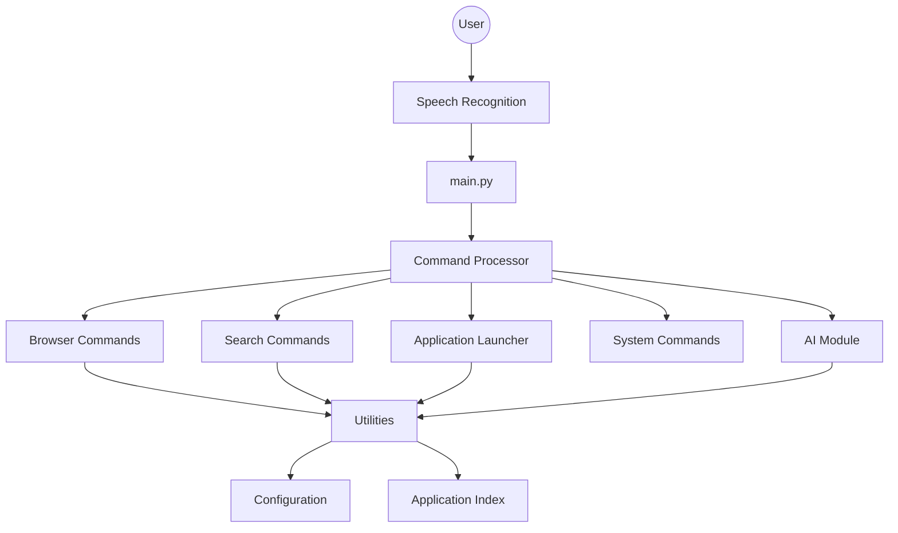
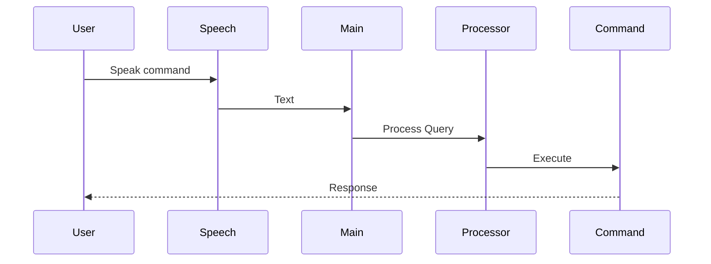
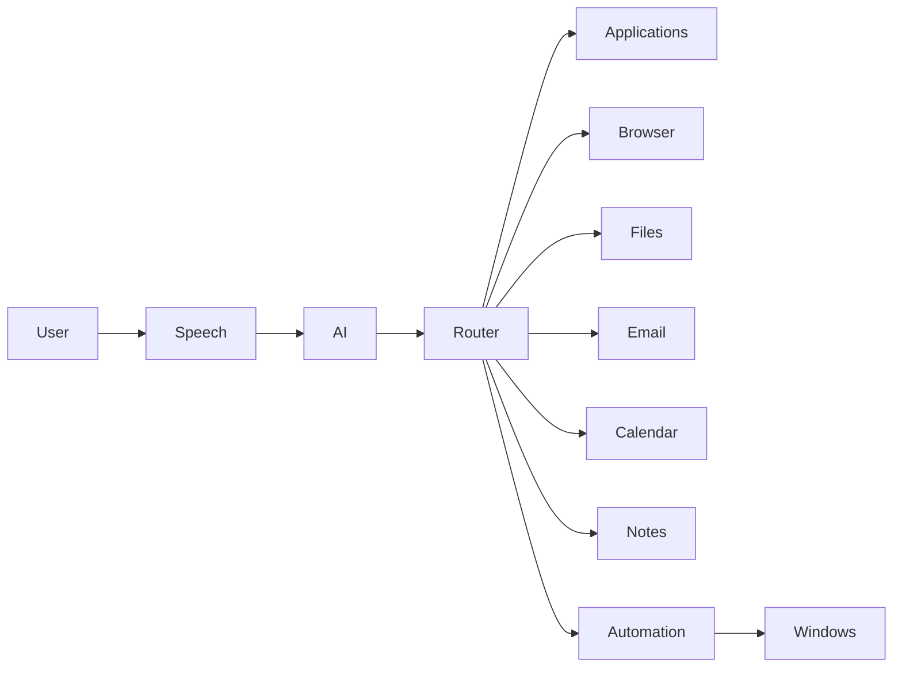

# IRES Architecture

## Overview

IRES is designed using a modular architecture where each module has a single responsibility. This makes the project easier to maintain, test, and extend with new features.

---

## High-Level Architecture



---

## Request Flow



---

## Project Structure

```text
IRES/
│
├── commands/
│   ├── apps.py
│   ├── browser.py
│   ├── search.py
│   └── system.py
│
├── utils/
│   ├── parser.py
│   ├── app_finder.py
│   └── app_index.py
│
├── cache/
│
├── docs/
│
├── speech.py
├── ai.py
├── config.py
├── command_processor.py
├── main.py
└── requirements.txt
```

---

## Module Responsibilities

| Module | Responsibility |
|---------|----------------|
| `main.py` | Starts the assistant and controls the main loop |
| `speech.py` | Speech recognition and text-to-speech |
| `command_processor.py` | Routes user commands to the correct module |
| `commands/` | Implements command-specific logic |
| `utils/` | Shared helper functions |
| `config.py` | Stores application aliases and configuration |
| `cache/` | Stores indexed application data |
| `ai.py` | Handles communication with the OpenAI API |

---

## Design Principles

- Modular Architecture
- Single Responsibility Principle
- Reusable Utility Functions
- Easy Feature Expansion
- Clear Separation of Concerns

---

## Future Architecture



The current implementation focuses on the core command-processing pipeline while keeping the architecture flexible for future modules such as file management, reminders, and desktop automation.